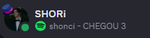
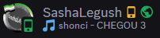
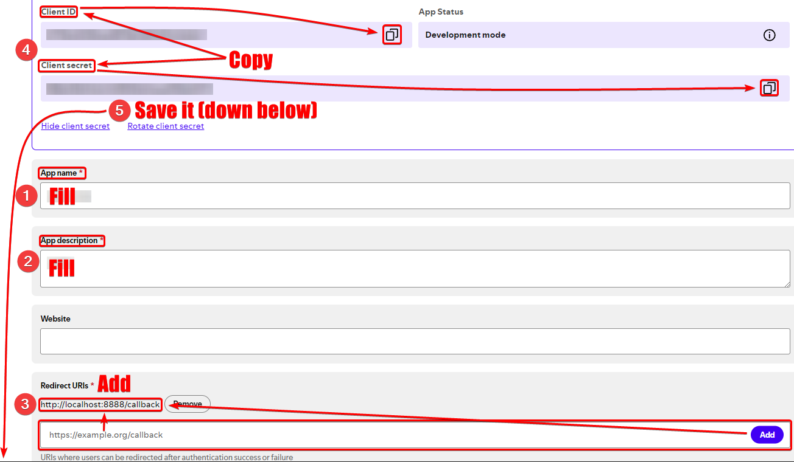
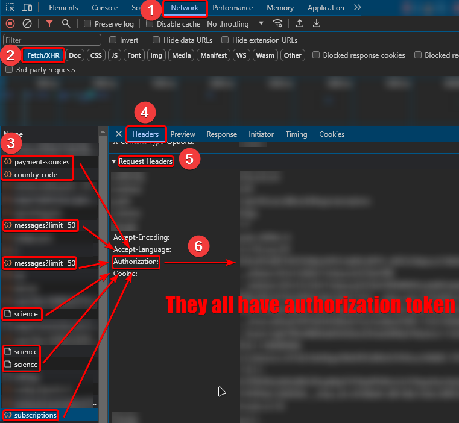

<h1 align="center">
  <br>
  Spoticord
</h1>
<p align="center">
Set your Discord status as your currently playing Spotify song. (Nitro check included for spotify icon)
<h1 align="center">
 
</h1>

# ⚠ Before You Begin
This script was recreated from my orignal script for personal use. I'm not responsible for anything that happens to your account.


# 📚 Getting Started 
You need `git`, `python3` and `pip3` installed on your machine. The installation process may differ on different OSes. This usually works on Debian/Ubuntu.
```
sudo apt update
sudo apt install git python3 python3-pip -y
```
Clone this repository and install requirements.
```
git clone https://github.com/Nx0Ri/Spoticord.git
cd Spoticord/
pip3 install -r requirements.txt
```

# 📚 Getting Started (Easy | Windows)
You need [Python](https://www.python.org/ftp/python/3.11.9/python-3.11.9-amd64.exe) on your pc.<br>
Download this repository and install requirements.
```
cd Spoticord/
pip install -r requirements.txt
```

# 🖥 Configure and Run
## 🛠 Usage
Get your Discord Token of account: [Discord Token](#discord-token).<br>
Get your Client ID and Client Secret by creating Spotify Developer Application: [Spotify Developer Application](#spotify-developer-application).

1. Paste your token in `token` field in bot.py.
2. Copy the `client_id` and `client_secret` and place them in the spotify.py in `SPOTIPY_CLIENT_ID` and `SPOTIPY_CLIENT_SECRET`.
3. Use: `python3 bot.py` or use .bat files.<br>
If nothing is wrong, the script should open a Spotify login URL.<br>
Login, and you're done!

## 🎶 Spotify Developer Application
1. Head to the [Spotify Developer Dashboard](https://developer.spotify.com/dashboard/applications) and create an application.
2. Make sure your `Redirect URL's` is set to `http://localhost:8888/callback` unless changed in the spotify.py.
3. Copy the `client_id` and `client_secret`.



## 📋 Discord Token
- Open the developer console with `F12` or `ctrl+shift+i`.
- Go to the network tab.
- Filter by Fetch/XHR.
- Choose one of requests shown on image below.
- Under the `Request Headers` -> `Authorization` section, there will be your Discord token. Copy it.



# License
[MIT License](LICENSE)
